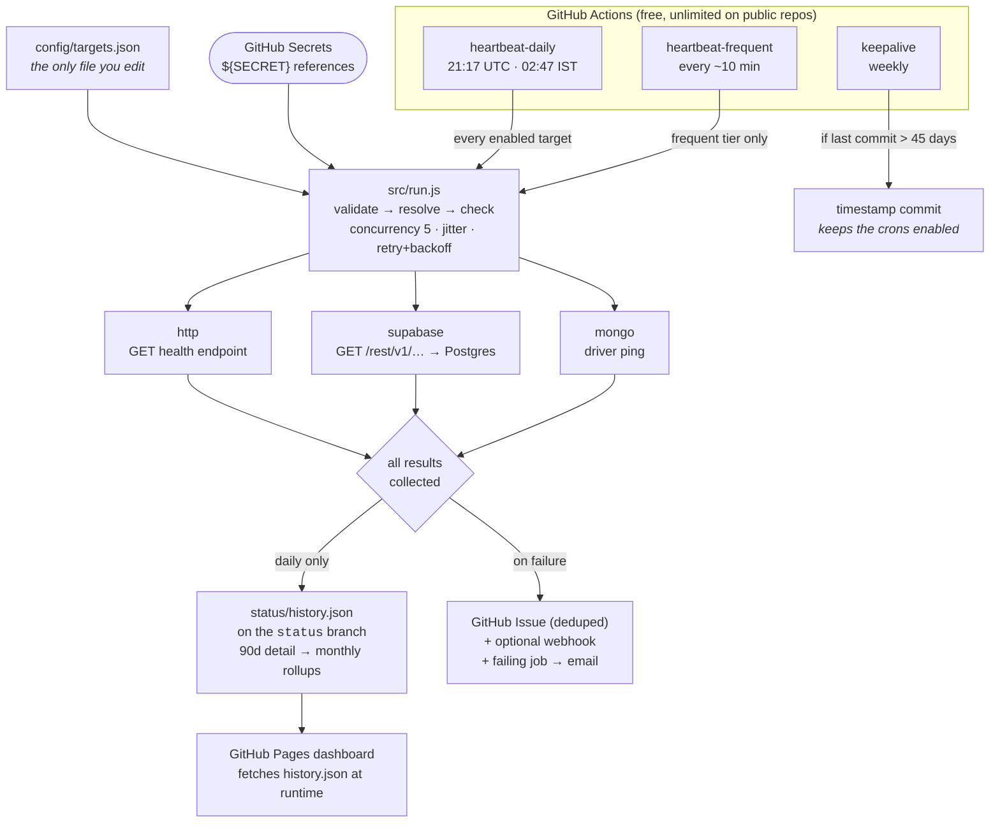

# Pulse

[](https://github.com/<YOUR_GITHUB_USERNAME>/pulse/actions/workflows/heartbeat-daily.yml)
[](https://github.com/<YOUR_GITHUB_USERNAME>/pulse/actions/workflows/validate.yml)
[](./LICENSE)

**A self-hosted, zero-cost keep-alive and uptime monitor for free-tier side projects.**
GitHub Actions runs the checks, a GitHub Pages site shows the results, and nothing else is involved.

📊 **[Live dashboard](https://<YOUR_GITHUB_USERNAME>.github.io/pulse/)** · 🛠 **[SETUP.md](./SETUP.md)** — the checklist to make it yours

---

## The problem

Free tiers sleep, and they each measure "activity" differently:

| Platform             | Sleeps after     | What actually counts as activity                              |
| -------------------- | ---------------- | ------------------------------------------------------------- |
| **Supabase**         | ~7 days          | A statement reaching **Postgres**. Frontend hits don't count. |
| **MongoDB Atlas** M0 | ~30 days         | A **driver connection**, not an HTTP request.                 |
| **Render** free      | 15 minutes       | Inbound **HTTP** traffic.                                     |
| Neon, Turso, D1      | (they auto-wake) | Nothing needed — see [when to stop](#when-to-stop-doing-this) |

Pinging a project's homepage satisfies none of the first three. Pulse pings the thing that actually
counts, on a schedule, records the result, alerts you when a check fails, and publishes a dashboard.

## Adding a project is one entry in one file

That is the design goal everything else bends around. No code, no workflow edits:

```jsonc
{
  "id": "your-slug",
  "name": "Your Project",
  "type": "supabase",
  "tier": "daily",
  "platform": "vercel+supabase",
  "supabaseUrl": "https://yourprojectref.supabase.co",
  "apiKey": "${YOUR_SLUG_SUPABASE_ANON_KEY}",
  "requiredSecrets": ["YOUR_SLUG_SUPABASE_ANON_KEY"],
}
```

Add the secret in the GitHub UI, push, done. CI fails the push if the entry is malformed, duplicates
an id, or references a secret it did not declare. Full walkthrough:
[SETUP.md §4](./SETUP.md#4-add-a-new-project-in-60-seconds).

## How it works



**Design decisions worth knowing:**

- **Zero runtime dependencies.** The pinger runs straight from source on Node 20+ with built-in
  `fetch` — the heartbeat workflows have no `npm install` step at all. The `mongodb` driver is
  installed on demand, only for runs whose config contains a `mongo` target.
- **Never fails fast.** Every target is checked, all results are collected, and only then does the
  process exit `1` if any of them failed. One dead project cannot stop the other twenty from being
  pinged.
- **`daily` covers everything; `frequent` is the narrow one.** The daily run is what writes history,
  so it checks every enabled target regardless of tier — otherwise a Render service would never get a
  dashboard card. The frequent run exists only to keep short-spin-down services awake in between.
- **Only the daily run commits.** One commit a day, not one per check.
- **The JSON Schema is the single source of truth**, interpreted at runtime by a small in-house
  validator ([`src/config/schema.js`](./src/config/schema.js)) so CI and the runtime produce identical
  messages without adding a dependency. Your editor reads the same file for autocomplete.
- **Secrets never appear in the repo.** Any string may contain `${SECRET_NAME}`, resolved from the
  environment at run time. A missing one fails loudly, by name, before any request — it never pings
  with the literal `${...}`. Resolved values are masked in logs, history, and issue bodies.
- **JSDoc + `checkJs`, not TypeScript.** Type-checked in CI via `tsc --noEmit`, with no build step
  between the source and what the workflow runs. That property is what keeps this reliable.

### Adding a new check type

One file in [`src/checks/`](./src/checks/) exporting the `Check` shape, one line in the registry, one
value in the schema's `type` enum. Validation fails if those three ever drift apart.

## Repository layout

```
.github/workflows/   heartbeat-daily · heartbeat-frequent · keepalive · validate · deploy-dashboard
config/              targets.json  ← the file you edit;  targets.schema.json  ← the contract
src/
  run.js             CLI entrypoint (--tier, --target, --dry-run, --notify, --out)
  runner.js          concurrency, jitter, retries, timeouts, result collection
  checks/            http.js · supabase.js · mongo.js · index.js (registry)
  config/            load.js · validate.js · interpolate.js · schema.js
  history.js         load / append / prune / roll up
  notify.js          GitHub issues + optional webhook
  report.js          console table + GitHub step summary
  tools/             validate-config · record-history · ensure-drivers
dashboard/           static site, no build step
templates/           health endpoints that genuinely touch the database
test/                node:test, no network access
```

Two deviations from a flatter layout, both deliberate: `src/config/` and `src/tools/` exist so
`run.js` stays a thin CLI and the loader, validator, and one-shot scripts stay individually testable.

## Commands

```bash
npm run validate      # validate config/targets.json — no network, no secrets needed
npm run dry-run       # resolve and print the plan without sending a request
npm test              # unit tests (node:test, fetch is mocked)
npm run verify        # lint + format + typecheck + test + validate
node src/run.js --target your-slug       # re-check one project
node src/run.js --tier frequent          # what the frequent workflow runs
```

## The GitHub cron trap

**GitHub disables scheduled workflows in a repository after 60 days without commit activity**, and
only a new commit resets that timer. It emails the repository owner, and that email is easy to miss.

A keep-alive system that dies after two months is **worse than useless**: you will believe you are
covered while your projects are quietly paused one by one. That is the exact failure this project
exists to prevent, so it must not have it.

[`keepalive.yml`](./.github/workflows/keepalive.yml) runs weekly, measures the age of the last commit
on the default branch, and makes a trivial timestamp commit if it is over 45 days — 15 days of margin.
The daily history commits also count as activity, but they land on the `status` branch, so the
keepalive commit on the default branch is the one that reliably resets the timer.

### Timing, honestly

- **Cron is UTC.** You are in IST (UTC+5:30). The daily run at `21:17 UTC` is **02:47 IST**.
- **`:00` is the most congested minute** on GitHub's scheduler, so no cron here uses it.
- **Scheduled runs are best-effort.** Delays of 5–30 minutes are routine under load, and a scheduled
  run is occasionally skipped entirely. Irrelevant against Supabase's 7 days or Atlas's 30. **Not
  irrelevant against Render's 15 minutes** — which is why the frequent tier targets 10 minutes rather
  than 14, and why it is still best-effort rather than a guarantee. A 10-minute cron that drifts by
  20 minutes will let a Render service spin down.

## This is a workaround

Worth saying plainly, because it affects whether you should rely on it:

- **Render states there is no supported way to keep a free service permanently awake**, and that the
  answer is a paid instance. Pulse's frequent tier works against the letter of the spin-down rule, not
  with the platform's blessing. It can stop working whenever Render decides it should.
- **Supabase's pause is a deliberate resource policy**, not a bug. Pulse satisfies it by generating
  genuine (if trivial) database activity. That is within the rules as they exist today; the threshold,
  the definition of activity, and the policy itself can all change.
- **Render's 750 instance-hours are per account, not per service.** One service awake 24/7 consumes
  ~730 of them. You can keep exactly one Render service permanently awake — see
  [SETUP.md §5](./SETUP.md#render) for the arithmetic.
- **This is fragile by design.** It depends on three free tiers behaving as they do today. It is the
  right trade for personal projects and a portfolio. It is the wrong trade for anything anyone depends
  on.

### When to stop doing this

If you find yourself maintaining this instead of your projects, migrate. These are free, auto-wake on
the first query with no manual restore, and need none of it:

| Instead of                      | Use                                       | Why                                                                                         |
| ------------------------------- | ----------------------------------------- | ------------------------------------------------------------------------------------------- |
| Supabase free (7-day pause)     | **Neon**                                  | Postgres that scales to zero and wakes on connection in ~hundreds of ms. No pause to avoid. |
| Supabase / Atlas for small apps | **Turso**                                 | SQLite at the edge, generous free tier, no idle timer.                                      |
| Anything already on Cloudflare  | **D1**                                    | SQLite bound to Workers. No cold-pause concept.                                             |
| Render free web services        | **Cloudflare Workers / Vercel functions** | Serverless: no instance to spin down, so nothing to keep awake.                             |

The honest summary: **Pulse is the right answer for projects that are already on Supabase, Atlas, or
Render and that you do not want to migrate. It is the wrong answer for something you are building
today** — pick a backend that never sleeps and skip the whole problem.

## License

MIT — see [LICENSE](./LICENSE).
